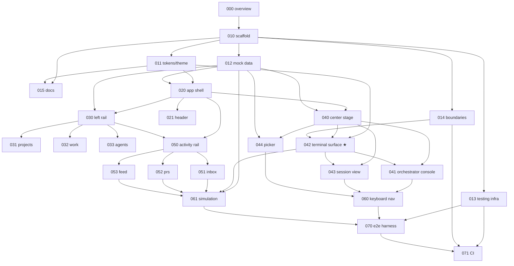

# The Hive — Story Backlog (static React prototype)

Stories for the first materialization of the concept in `../concept/`: a **static
React + TypeScript prototype** with real **xterm.js** terminal surfaces fed by mock
data. No backend in this phase; the terminal transport is the designed seam for the
future local-PTY daemon. Context and decisions: [000-overview.md](000-overview.md).

The backlog is modeled on the architecture of `incorpHQ/incorpx` — feature slices with
lint-enforced boundaries, Zustand with selector hooks, a `tests/` mirror with an 80%
coverage gate, and a thin `AGENTS.md` over deep-dive docs. See
[000-overview.md](000-overview.md) → *Architecture baseline* for the full mapping and
for what we deliberately left behind.

## Conventions

- One story per file, numbered by epic decade. Each has an ID (`HIVE-0xx`), explicit
  **Depends on / Blocks** links, a **Location** naming where the code lands, a
  **Points** estimate, a user story, spec, tests, and acceptance criteria.
- Specs quote the concept's exact values (colors, sizes, copy) — the concept file is
  the visual source of truth when a story is silent.
- A story is *done* when its acceptance boxes check off against the running app **and**
  its tests are green under the coverage gate ([013](013-testing-infrastructure.md)).

## Index

| # | Story | Epic | Pts |
|---|---|---|---|
| 000 | [Overview & prototype scope](000-overview.md) | Foundation | 1 |
| 010 | [Project scaffold](010-project-scaffold.md) | Foundation | 5 |
| 011 | [Design tokens & theming](011-design-tokens-and-theming.md) | Foundation | 3 |
| 012 | [Mock data layer](012-mock-data-layer.md) | Foundation | 8 |
| 013 | [Testing infrastructure](013-testing-infrastructure.md) | Foundation | 3 |
| 014 | [Architecture boundaries & lint enforcement](014-architecture-boundaries.md) | Foundation | 3 |
| 015 | [Project docs & agent guidance](015-project-docs.md) | Foundation | 2 |
| 020 | [App shell layout](020-app-shell-layout.md) | Shell | 3 |
| 021 | [Header](021-header.md) | Shell | 5 |
| 030 | [Left rail (container & tabs)](030-left-rail.md) | Left rail | 3 |
| 031 | [Projects panel](031-projects-panel.md) | Left rail | 3 |
| 032 | [Work panel](032-work-panel.md) | Left rail | 3 |
| 033 | [Agents panel](033-agents-panel.md) | Left rail | 2 |
| 040 | [Center stage (view states)](040-center-stage.md) | Center stage | 5 |
| 041 | [Orchestrator console](041-orchestrator-console.md) | Center stage | 8 |
| 042 | [**Terminal surface (xterm.js)** — core](042-terminal-surface.md) | Center stage | 13 |
| 043 | [Session / agent terminal view](043-session-view.md) | Center stage | 5 |
| 044 | [New session picker](044-new-session-picker.md) | Center stage | 5 |
| 050 | [Activity rail (container & tabs)](050-activity-rail.md) | Activity rail | 2 |
| 051 | [Inbox panel](051-inbox-panel.md) | Activity rail | 3 |
| 052 | [PRs panel](052-prs-panel.md) | Activity rail | 3 |
| 053 | [Activity feed panel](053-activity-feed-panel.md) | Activity rail | 2 |
| 060 | [Keyboard navigation](060-keyboard-navigation.md) | Cross-cutting | 5 |
| 061 | [Simulation mode](061-simulation-mode.md) | Cross-cutting | 5 |
| 070 | [Playwright e2e harness](070-e2e-harness.md) | Cross-cutting | 5 |
| 071 | [CI workflow](071-ci-workflow.md) | Cross-cutting | 2 |

**26 stories · 107 points.**

| Epic | Stories | Points |
|---|---|---|
| Foundation | 000, 010, 011, 012, 013, 014, 015 | 25 |
| Shell | 020, 021 | 8 |
| Left rail | 030, 031, 032, 033 | 11 |
| Center stage | 040, 041, 042, 043, 044 | 36 |
| Activity rail | 050, 051, 052, 053 | 10 |
| Cross-cutting | 060, 061, 070, 071 | 17 |

## Jira

The backlog lives in the **HIVE** project on `behiques.atlassian.net`. Doc IDs
(`HIVE-0xx`, the file numbering) are *not* Jira keys — Jira assigned its own. The
mapping:

| Epic | Jira key | Stories (doc → Jira) |
|---|---|---|
| Foundation | `HIVE-1` | 000→`HIVE-7`, 010→`HIVE-8`, 011→`HIVE-9`, 012→`HIVE-10`, 013→`HIVE-11`, 014→`HIVE-12`, 015→`HIVE-13` |
| Shell | `HIVE-2` | 020→`HIVE-14`, 021→`HIVE-15` |
| Left rail | `HIVE-3` | 030→`HIVE-16`, 031→`HIVE-17`, 032→`HIVE-18`, 033→`HIVE-19` |
| Center stage | `HIVE-4` | 040→`HIVE-20`, 041→`HIVE-21`, 042→`HIVE-22`, 043→`HIVE-23`, 044→`HIVE-24` |
| Activity rail | `HIVE-5` | 050→`HIVE-25`, 051→`HIVE-26`, 052→`HIVE-27`, 053→`HIVE-28` |
| Cross-cutting | `HIVE-6` | 060→`HIVE-29`, 061→`HIVE-30`, 070→`HIVE-31`, 071→`HIVE-32` |

Each Jira Story carries its full spec (tables, code blocks, acceptance checkboxes), its
story-point estimate, and real **Blocks / is blocked by** links mirroring the graph
below — 45 links in total. The rendered graph is attached to the Foundation epic.

**These markdown files remain the source of truth.** When a story changes here, update
its Jira issue too; nothing syncs automatically.

## Dependency graph

## Suggested sprint slicing

1. **Walking skeleton**: 010 → 011 → 012 → 013 → 014 → 020 — dark shell renders with
   the store, and the fences plus the test harness exist *before* there is anything to
   fence in. Doing 013/014 later means retrofitting, which is how they get skipped.
2. **See the fleet**: 021, 030, 031, 015 — header counts + project tree navigate (to an
   empty center); docs seeded while the conventions are fresh.
3. **The terminal** *(the milestone that matters)*: 040, 042, 043 — open any session,
   real xterm, send a message, watch it ack.
4. **Command the hive**: 041, 044, 060 — orchestrator table + commands + picker +
   keyboard.
5. **Attention loop**: 050, 051, 052, 053, 032, 033 — inbox→terminal jump, PRs, feed.
6. **Make it breathe & prove it**: 061, 070, 071 — simulation for demos, e2e specs that
   actually verify the terminal, CI that enforces all of it.

## After this phase (not written as stories yet)

Real transport behind [042](042-terminal-surface.md)'s seam: a local daemon owning
node-pty processes (one per session), WebSocket/IPC bridge, real `claude` sessions,
orchestrator logic moving out of the store into the daemon. Desktop wrapper
(Electron/Tauri) once the web prototype proves the UX.

Because the seam is a lint-enforced boundary ([014](014-architecture-boundaries.md))
rather than a convention, that work should touch `src/lib/terminal/` and nothing else
in the component tree.
